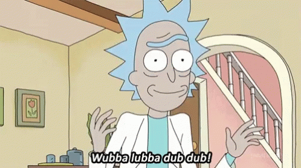

# Hi there! I'm Buğra 

I realized that I could bring my thoughts and dreams to life by learning software. Since web development has an important place in the software world, I started my career in this area. I'm familiar with basic web technologies. I'm actively working to develop myself in the frontend area. After gaining experience in this area, I plan to develop myself in the backend area and become a full-stack developer.
**You can contact me via [email](mailto:bugrabasbostanci143@gmail.com)** 

## 🧰 My Toolbox

The skills, tools and technologies I use in my projects:
              

---

